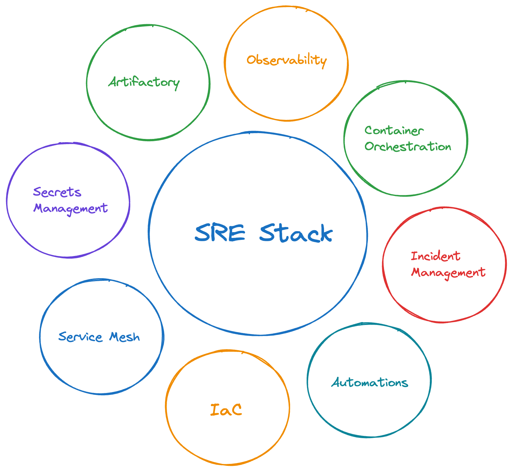

# SRE Stack

Throughout my career as an SRE developer, I encountered different challenges. Sometimes these occur at the beginning, or also as your team and projects grow.

These are several of the technologies that I have tested, although not all of them have been put into production.

The order of implementation is not so relevant, although I always recommend starting with observability

1. [Observability](#Observability)
1.1 [Prometheus](#Prometheus)
1.2 [Exporters](#Exporters)
1.3 [Grafana](#Grafana)
1.4 [Fluentbit](#Fluentbit)
1.5 [New Relic](#New-Relic)
1.6 [Datadog](#Datadog)
1.7 [Open Telemetry](#Open-Telemetry)
1.8 [Jager](#Jager)
2. [Container Orchestration](Container-Orchestration)
2.1 [Kubernetes](Kubernetes)
3. [Incident Management](Incident-Management)
3.1 [Zenduty](#Zenduty)
3.2 [Dispatch](Dispatch)
3.3 [Oncall + Iris](Oncall-Iris) 
4. [Automations](Automations)
4.1 [Jenkins](#Jenkins)
4.2 [GitOps CI/CD](GitOps-CI/CD)
4.2.1 [Gitlab CI](#Gitlab-CI)
4.2.2 [Github Actions](#Github-Actions)  
4.2.3 [ArgoCD](#ArgoCD)
4.3 [Flow Orchestrator](Flow-Orchestrator)
4.3.1 [Prefect](Prefect)
4.3.2 [Airflow](Airflow)  
4.4 [Release Enginering](Release-Enginering)
4.4.1 [Bazel](#Bazel)
5. [IaC](IaC)
5.1 [Terraform](#Terraform)
5.2 [Ansible](#Ansible)
6. [Service Mesh](Service-mesh)
6.1 [Istio](Istio)
7. [Secrets Management](Secrets-Manegement)
7.1 [Vault Hashicorp](#Vault-Hashicorp)
8. [Artifactory](Artifactory)
8.1 [Jfrog Artifactory](Jfrog-Artifactory)

## Observability
Observability is the first step I recommend taking in SRE, given that the other points depend greatly on whether you have monitoring on your system. And in terms of automation, it is very likely that by this point I already have several automations working.

The following recommendations are personal and that I have tried. As I try better solutions, I will include them in this project.

If you are working in the cloud, the solution may be simpler since the main clouds already come with their own observation tools that work very well. Some with an additional cost. Here we are going to focus on-premise.

Generally, if you work on-premise, it is common to install these solutions in a container orchestrator such as kubernetes, but here we are going to keep it simple and install it directly on a Linux server.

