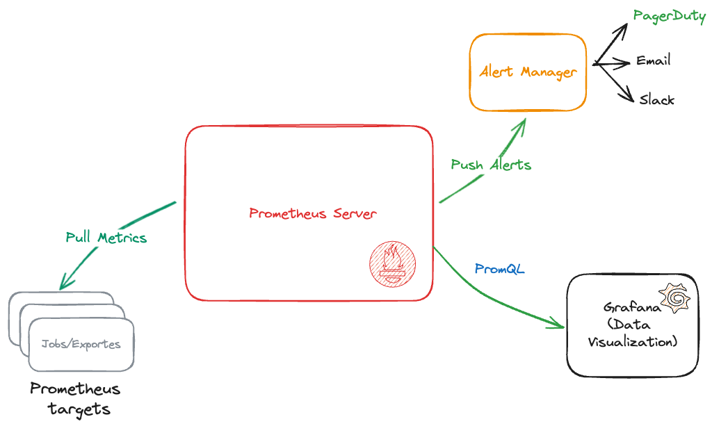

### Prometheus

Prometehus is a central processor of information from different sources. These sources are known as exporters or prometheus targets, since they are the ones that provide information to prometheus in a language that prometheus can read. The best known is `node_exporter`, which allows you to know the resources available and used in real time on a server, whether Linux or Windows.

This information is stored by Prometheus, as a Time Series Database (TSDB). Prometheus then has the ability to provide this data to `Alert Manager` and `Grafana` for real-time viewing.

Source: [Prometheus documentation](https://prometheus.io/docs/introduction/overview/)

#### Install exporter
First I recommend installing the explorer on each server that you need to monitor its metrics.
[Node exporter](https://github.com/prometheus/node_exporter)
These will be exposed on port 9100, for example `http://localhost:9100`

Then a central monitoring server will read those metrics, store them, and then do custom processing, create dashboards with grafana and even generate alerts according to the rules that we have indicated.

#### Install Prometheus

We will install Prometheus directly on the system, without the use of docker or kubernetes.

### Grafana
Grafana is a data visualizer generally used for real-time monitoring metrics. It can read from different data sources and the most common are the TSDB with the PromQL language.

Source: [Grafana](https://grafana.com/docs/grafana/latest/)